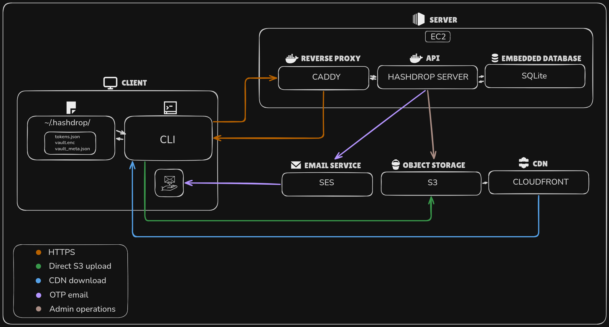

# Hashdrop

> A zero-trust, command-line file storage tool built in Go. Files are encrypted on your device before upload — the server and storage layer only ever see encrypted blobs. Your plaintext data never touches the server.

> [!WARNING]
> **Deployment is currently pending. Hashdrop is not yet live and is under active development.**

---

## How It Works

1. **Encrypt locally** — files are encrypted on your machine before anything leaves it
2. **Upload safely** — only the encrypted blob reaches cloud storage (AWS S3)
3. **Share a link** — recipients get a short-lived signed download URL via CloudFront
4. **Decrypt on their end** — the recipient uses the shared key or passphrase to decrypt and verify the file

---

## Features

- **Client-side AES-GCM encryption** — each file gets its own unique Data Encryption Key (DEK)
- **Token-based authentication** — JWT access tokens with revocable refresh tokens
- **Integrity verification** — plaintext hash stored at upload time so tampering can be detected
- **Local vault** — encryption keys stored in an AES-GCM encrypted vault at `~/.hashdrop/vault.enc`
- **Passphrase mode** — opt out of the vault and manage your own passphrase instead

---

## Architecture



Hashdrop has two main components:

**CLI** — a Go Cobra-based client that handles encryption, uploads, downloads, decryption, and local key and token management.

**API Server** — a Go HTTPS server running on AWS EC2 behind a reverse proxy. It handles authentication, file metadata, presigned S3 upload URLs, signed CloudFront download URLs, and abuse prevention.

For a full breakdown see [Architecture](./docs/architecture.md).

---

## Installation
```bash
go install github.com/anxhukumar/hashdrop/cli/cmd/hashdrop@latest
```

See the [Installation guide](./docs/installation.md) for full setup instructions and troubleshooting.

---

## Quick Start
```bash
# Register and verify your account
hashdrop auth register

# Log in
hashdrop auth login

# Upload a file
hashdrop upload ./secret.pdf

# List your files
hashdrop files list

# Decrypt and download a file
hashdrop decrypt <download-url>
```

See the [CLI Usage guide](./docs/usage.md) for the full command reference.

---

## Tech Stack

- **Go** — server and CLI
- **AWS EC2** — server hosting
- **AWS S3** — encrypted object storage
- **AWS CloudFront** — signed URL delivery
- **AWS SES** — OTP email delivery
- **SQLite** — embedded metadata storage
- **sqlc** — type-safe SQL query generation
- **Caddy** — reverse proxy and HTTPS termination

---

## Documentation

- [Architecture](./docs/architecture.md)
- [Security Model](./docs/security_model.md)
- [Installation](./docs/installation.md)
- [CLI Usage](./docs/usage.md)
- [File Upload](./docs/uploading.md)
- [Downloading and Decryption](./docs/decryption-and-downloading.md)
- [Authentication](./docs/authentication.md)
- [Resource Limits and Abuse Prevention](./docs/resource-limits-and-abuse-prevention.md)
- [API Reference](./docs/api.md)

---

## License

Copyright 2026 Anshu Kumar

Licensed under the Apache License, Version 2.0. See [LICENSE](./LICENSE) for the full license text.